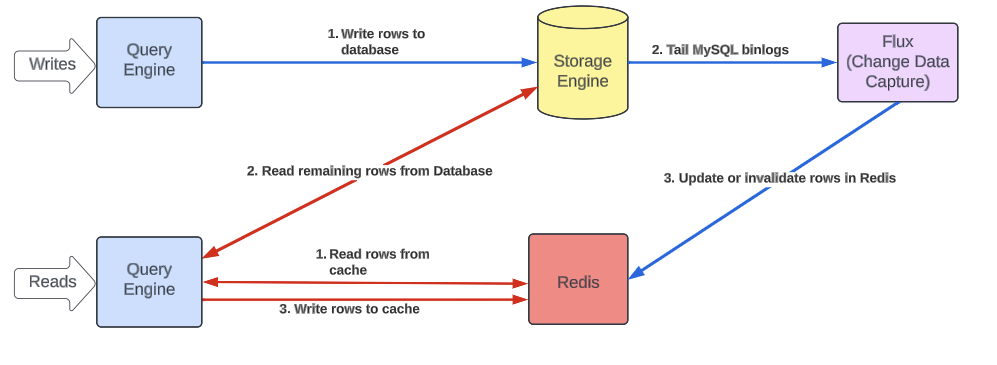

# Educational Implementation of Uber's CacheFront

[](https://opensource.org/licenses/MIT)

This project aims to provide a simplified implementation of the **CacheFront** caching solution described in Uber's [blog post](https://www.uber.com/en-IN/blog/how-uber-serves-over-40-million-reads-per-second-using-an-integrated-cache/) for learning purposes.



## Key Features Implemented
- Cache invalidation using MYSQL8 Binlog.
- Deduplicating Cache Writes Between Query Engine and Change Data Capture
  - If a newer or equal timestamp value is already present in the cache, the write operation is skipped. Otherwise, the new value is written to the cache.   
  - Redis EVAL allows executing custom lua scripts atomically.
  - The deduplication_script.lua given below performs the deduplication logic atomically so multiple network calls and race conditions are avoided.

```
local dataKey = KEYS[1]
local newValue = ARGV[1]
local newTimestamp = tonumber(ARGV[2])

local currentValue = redis.call('GET', dataKey)

if currentValue then
    local separatorIndex = string.find(currentValue, ':')
    if separatorIndex then
        local currentTimestamp = tonumber(string.sub(currentValue, 1, separatorIndex - 1))
        if currentTimestamp and currentTimestamp >= newTimestamp then
            return nil
        end
    end
end

redis.call('SET', dataKey, newValue)
return 1
```
The Lua script prevents the race condition by performing the cache read, timestamp comparison, and data write operations atomically within a single execution context. This eliminates the possibility of concurrent processes interfering with each other and ensures that the cache always contains the newest data based on the timestamp comparison.

- Cache is centralized, decoupled from query and storage engine, provides high-throughput, and consistency.

Please note that this implementation is not production-ready and does not exactly match Uber's original design. It is built solely for educational purposes to understand the key concepts.

## Table of Contents

- [Architecture](#architecture)
- [Getting Started](#getting-started)
 - [Prerequisites](#prerequisites)
 - [Installation](#installation)
- [Usage](#usage)
- [Contributing](#contributing)
- [License](#license)

## Architecture

The py-cachefront project consists of the following components:

- **Storage Engine**: MySQL database for persistent storage of data.
- **Query Engine**: Python application that handles read and write operations to the storage engine and cache.
- **Change Data Capture (CDC)**: Cache invalidation logic that captures data changes from the storage engine's binlog and invalidates the corresponding cache entries.
- **Redis**: Redis used as a cache layer.

The components are dockerized and can be run using Docker Compose for easy setup and experimentation.

## Getting Started

### Prerequisites

- Docker
- Docker Compose

### Installation

1. Clone the repository:

  ```bash
  git clone https://github.com/navkiran/py-cachefront.git
  ```

2. Navigate to the project directory:

  ```bash
  cd py-cachefront
  ```

3. Start the services using Docker Compose:

  ```bash
  docker-compose up -d
  ```

4. Wait for all containers to start/turn healthy, storage-engine/MYSQL8 takes a few seconds:

  ```bash
  docker-compose ps
  ```

5. Then, run the demo script to see the flow:

  ```bash
  docker-compose exec -it query-engine python demo.py      
  ```

## Usage
Once the services are up and running, you can interact with the query engine to perform read and write operations. The change data capture will automatically handle cache invalidation based on the storage engine's binlog events.

There is NO MANUAL CACHE INVALIDATION step being done in query-engine/app.

You can modify the code in the query-engine directory to add your own application logic and experiment with different scenarios.

## Contributing
Contributions to this project are welcome! If you find any issues or have suggestions for improvements, please open an issue or submit a pull request. 

## License
This project is licensed under the MIT License. See the LICENSE file for more information.

------------------------------

Disclaimer: This project is built for educational purposes and is not affiliated with or endorsed by Uber. It may not reflect the exact implementation details of Uber's CacheFront system.
